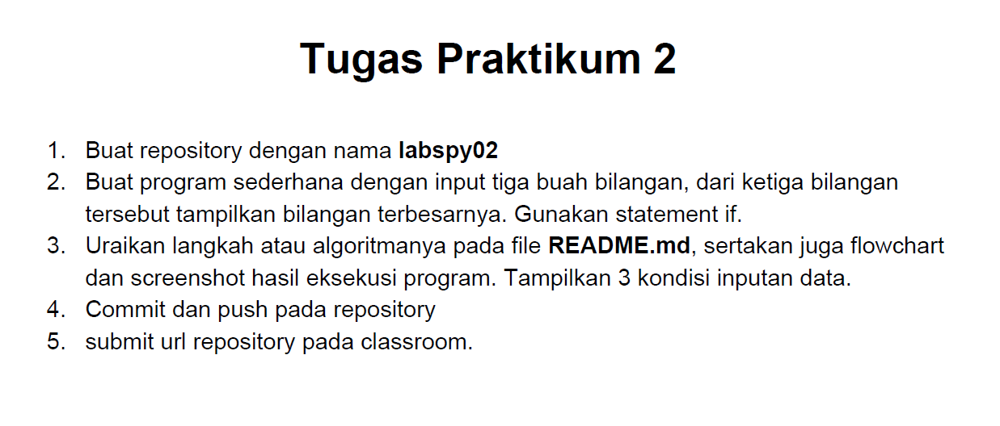
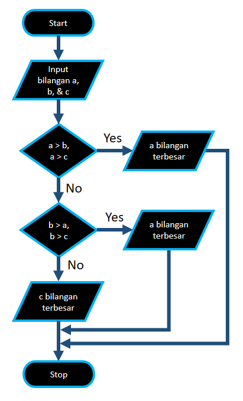
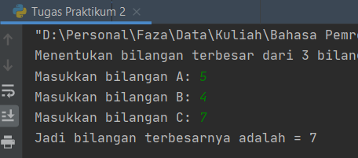

# labspy02
## Pertemuan 7 - Tugas Praktikum 2 
Pada praktikum ini di tugas no 2 adalah membuat membuat program sederhana dengan input tiga buah bilangan, dari ketiga bilangan
tersebut tampilkan bilangan terbesarnya dengan menggunakan ***statement if.***

<br>

Berikut adalah flowchartnya
<br>

Dari flowchart tersebut bisa dijelaskan untuk membuat program menentukan bilangan terbesar dari 3 bilangan yang telah di input
1. Masukkan 3 bilangan, a, b & c
2. Jika a lebih besar dari b & c, maka a adalah bilangan terbesar
3. Jika b lebih besar dari a dan c, maka b adalah bilangan terbesar
4. Bila a tidak lebih besar dari b & c dan b tidak lebih besar dari a & c, maka c adalah bilangan terbesar

Untuk source code dari flowchart diatas adalah
```python
#Input 3 buah bilangan, menggunakan statement if
print ( "Menentukan bilangan terbesar dari 3 bilangan")
a = int ( input ( "Masukkan bilangan A: " ))
b = int ( input ( "Masukkan bilangan B: " ))
c = int ( input ( "Masukkan bilangan C: " ))
if a > b and a > c :
  print ( "Jadi bilangan terbesarnya adalah =" , a )
elif b > a and b > c :
    print ( "Jadi bilangan terbesarnya adalah =", b )
else :
    print ( "Jadi bilangan terbesarnya adalah =", c )
```
Penjelasan :<br>
> * Karena untuk menentukan bilangan terbesar dari 3 bilangan, akan ada 3 kondisi, maka dari itu source code nya menggunakan ***if elif***.<br>
> * Logika dari ***if elif*** adalah akan memeriksa apakah kondisi 1 bernilai true ? Jika tidak, apakah kondisi 2 bernilai true ? Jika tidak, apakah kondisi 3 bernilai true ? dan seterusnya, dan jika tidak ada kondisi yang bernilai true, maka python akan menjalankan statemen didalam blok else.<br>

1. Syntax dibawah berfungsi untuk memeriksa kondisi pertama apakah kondisi tersebut ***true*** atau ***false***, bila kondisi ini ***true*** maka akan keluar output ***"Jadi bilangan terbesarnya adalah = a"***, jika false maka berlanjut ke kondisi kedua
```python
if a > b and a > c :
  print ( "Jadi bilangan terbesarnya adalah =" , a )
```
2. Syntax dibawah adalah kelanjutan dari syntax diatas, yaitu untuk memeriksa kondisi kedua apakah ***true*** atau ***false***. Jika kondisi tersebut ***true*** maka akan keluar output ***"Jadi bilangan terbesarnya adalah = b"***, jika ***false*** maka lanjut ke kondisi ketiga
```python
elif b > a and b > c :
    print ( "Jadi bilangan terbesarnya adalah =", b )
```
3. Pada syntax dibawah adalah kondisi ketiga dimana apabila kondisi pertama dan kedua ***false***, maka akan berlanjut ke kondisi tiga ini dan akan keluar output ***"Jadi bilangan terbesarnya adalah = c"***.
```python
else :
    print ( "Jadi bilangan terbesarnya adalah =", c )
```

Hasil dari source code diatas, misalkan :
* a = 5
* b = 4
* c = 7

  

Maka bilangan terbesar dari nilai a, b & c tersebut adalah c = 7